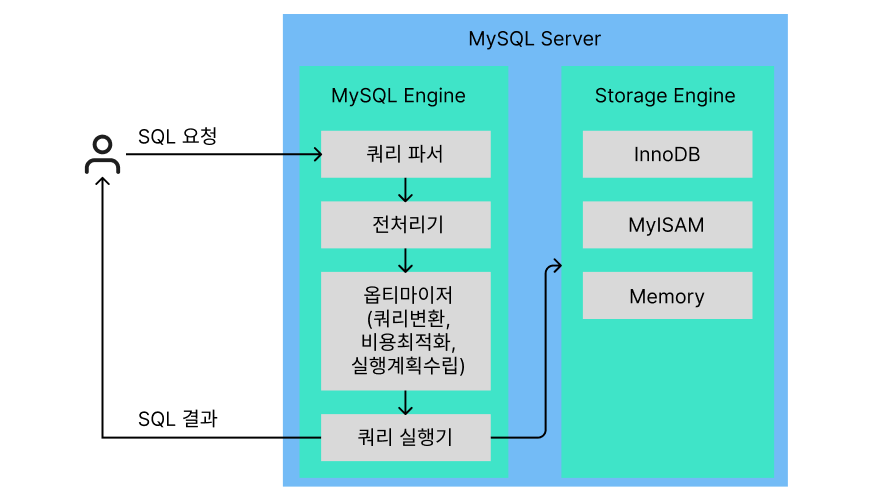
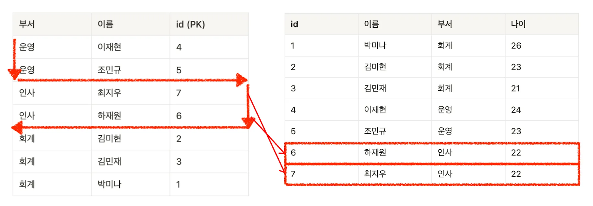
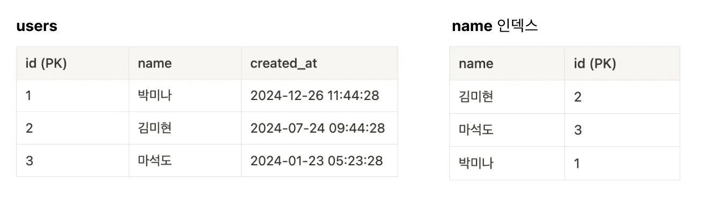
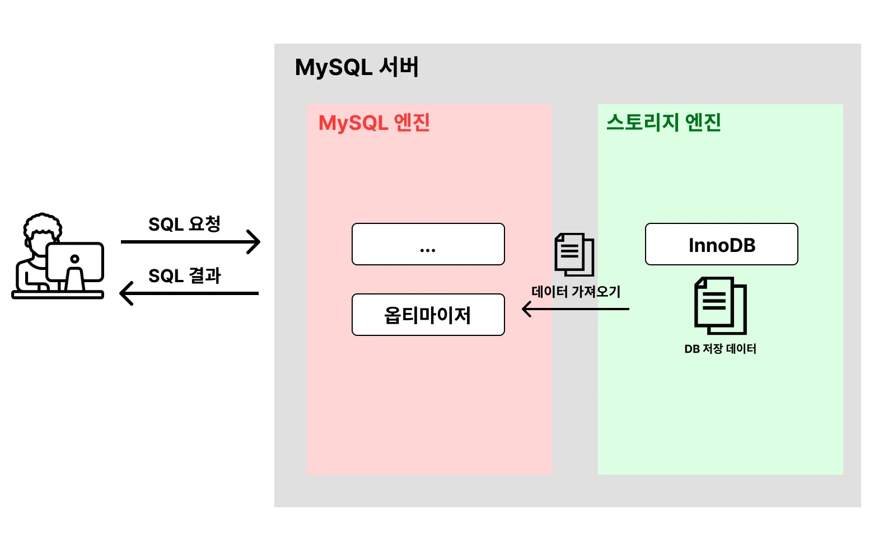
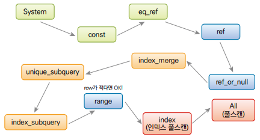
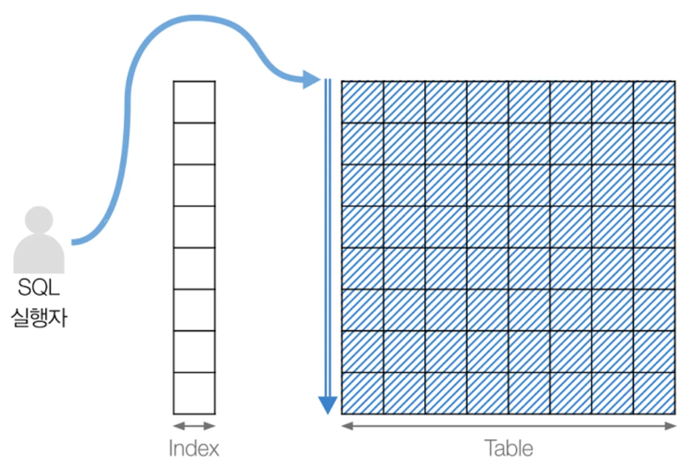
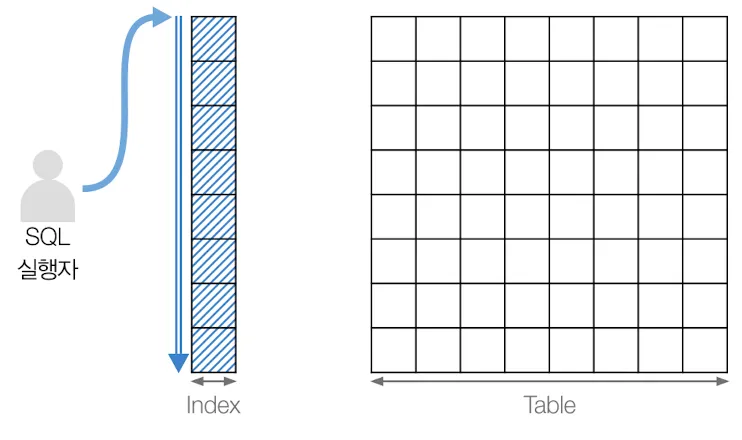
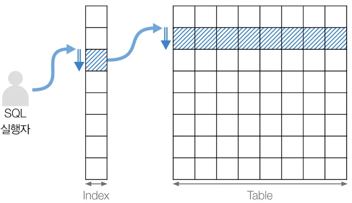
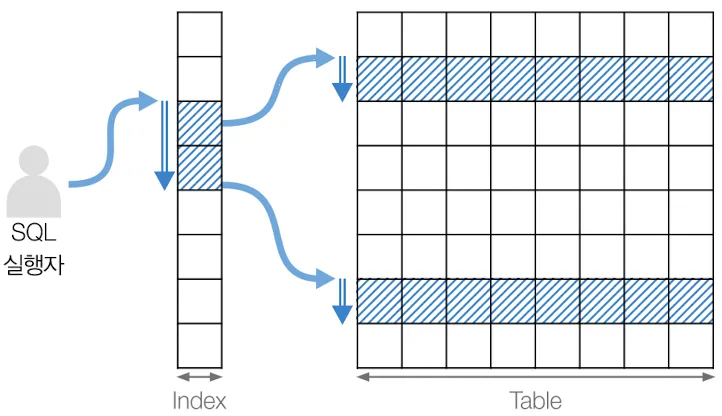

## MySQL 성능최적화 1

### 개요
- 데이터베이스 데이터를 사용하는데 처리시간을 줄이기위한 방안

#### 최적화 방법
1. 인덱스 최적화
    - 인덱스는 데이터 검색 속도를 높여주지만, 너무 많은 인덱스는 오히려 성능 저하를 초래할 수 있다.
    - PK에 자동으로 생성된다.
    - 자주 조회하는 컬럼이나 WHERE, JOIN 절에 사용되는 컬럼에 적절히 인덱스를 추가, 불필요한 인덱스를 제거한다.
    - 다중 컬럼 인덱스를 사용할 때는 컬럼 순서와 사용례를 고려하여 인덱스를 최적화하는 것이 중요하다.

2. SQL 쿼리 튜닝
    - 느린 쿼리를 감지하고 최적화하는 것이 `MySQL 성능 최적화의 핵심`!
    - `EXPLAIN`을 사용하여 쿼리 실행 계획을 분석하고, 풀 스캔(Full Scan)을 유발하는 쿼리를 식별, 풀스캔을 제거하는것이  최적화
    - 쿼리에서 불필요한 조인이나 서브쿼리를 줄이고, JOIN 대신 UNION을 사용하거나, 뷰(View)를 활용하는 것도 성능 향상에 도움이 될 수 있다.
    - 서브쿼리보다 조인이 빠른 것은 당연하다. 서브쿼리로 작성된것은 가능하면 조인으로 변경할 것

3. 캐싱 전략
    - 쿼리 캐싱은 동일한 쿼리가 반복될 때 캐시된 결과를 반환함으로써 속도를 향상시킬 수 있다.
    - MySQL 내장 쿼리 캐시 또는 외부 캐시 시스템(예: Redis, Memcached)을 사용하여 데이터베이스 부하를 줄일 수 있다.
    - 하지만, 쿼리 캐시가 활성화되면 캐시 업데이트로 인한 성능 저하가 발생할 수 있으므로 MySQL 8.0부터 삭제됨.
    - 현재는 InnoDB Buffer Pool사용(디스크대신 메모리캐시)으로 성능 개선

4. 테이블 설계 최적화
    - 정규화와 비정규화를 적절히 사용하여 데이터 중복을 줄이거나 중복일 시켜서 쿼리 성능을 향상시킨다.
    - 테이블 설계 시 필요한 데이터 타입을 신중하게 선택하고, `VARCHAR` 대신 `CHAR`를 사용하는 것이 성능에 유리할 때가 많다.
    - 파티셔닝을 통해 대용량 테이블을 여러 파티션으로 나누면 읽기와 쓰기 성능을 높일 수 있다.

5. 서버 환경 최적화
    - MySQL 설정 파일(my.cnf 또는 my.ini)에서 메모리, CPU 등 리소스를 적절히 조정하여 성능을 최적화할 수 있다.
    - 특히 `innodb_buffer_pool_size`는 InnoDB 스토리지 엔진을 사용하는 경우 매우 중요한 파라미터로, 가능한 많은 데이터를 메모리에 저장해 I/O를 줄일 수 있다.
    - `query_cache_size`, `sort_buffer_size`와 같은 설정을 최적화하여 쿼리 처리 속도를 개선할 수 있다.

6. 모니터링 및 분석
    - MySQL에서 제공하는 performance_schema나 외부 모니터링 도구(예: Prometheus, Grafana)를 통해 서버 상태와 쿼리 성능을 지속적으로 모니터링한다.
    - 주기적인 모니터링을 통해 쿼리 성능의 병목 구간을 파악하고, 필요한 경우 즉각적으로 조정할 수 있다.

#### 실무에서 DB최적화 
- 동시 사용자수가 증가
- 데이터양이 증가
- 비효율적인 SQL이 사용될 때
    - 포털 등의 솔루션에서는 무조건 3~5초 이내 최적화
    - 도메인 특화된 솔루션에서는 1~3분의 대기도 많음

### 사전준비
- MySQL Community Server : https://dev.mysql.com/downloads/installer/
- Dbeaver : https://dbeaver.io/

#### DBeaver 접속
- 내용 생략
- SQL 쿼리 에디터 추가
    - `F3` : 새로운 창이 오픈되어서 불편
    - `Ctrl + ]` : 바로 생성

### MySQL 아키텍처


1. 사용자가 DB에 SQL 요청
2. MySQL엔진에서 `쿼리 파서`에서 분석시작
3. `전처리기`로 처리 
    - SQL권한 확인
    - 테이블 존재여부 확인
    - 참조무결성 확인
4. `옵티마이저`에서 효율적으로 데이터를 가져올 수 있는 계획. `실행계획`
    - 인덱스 사용여부
    - 조인/필터 적용
    - 쿼리 변환
    - 비용기반 최적화
    - 단, 최적화 부분이 완벽하지 않음
5. 옵티마이저의 실행계획으로 쿼리실행, 스토리지엔진에서 데이터 가져옴
    - DB성능에 문제가 발생 대부분이 스토리지엔진에서 데이터가져올때 발생하는 원인
    - 스토리지엔진은 실제 DB저장방식, I/O을 담당
6. MySQL엔진에서 정렬, 필터링 처리한뒤 사용자에 결과리턴


### 인덱스 성능 측정

#### 인덱스 테스트

##### 예제 테이블 생성
```sql
-- 기존 테이블 삭제
drop table if exists users;

-- 사용자 테이블 생성
create table users (
	id int primary key auto_increment, -- PK, 자동증가
	name varchar(100),
	age int
);
```

##### 더미데이터 생성
```sql
/* CTE 사용방식 */
-- 재귀호출 회수를 설정, 100만건
set session cte_max_recursion_depth = 1000000;

-- 더미데이터 삽입 쿼리
insert into users (name, age)
  with recursive cte(n) as (
  	select 1
  	 union all
  	select n+1 from cte where n < 1000000  -- 생성하려는 더미데이터 개수
  )
select CONCAT('User_', LPAD(n, 7, '0')) -- 7자리 User_0000001 ~ User_999999
     , FLOOR(1 + RAND()*100) as age
  from cte;

-- 더미데이터 확인
select * from users;
```

##### 인덱스 생성
```sql
/* 인덱스 */
select * 
  from users
 where age = 25;
-- 인덱스 없을때 0.221s 소요
-- 인덱스 생성 후 0.127s 소요

-- 인덱스 생성, 1초 소요
create index idx_user_age on users(age);
```

- 인덱스가 없을 경우 - 0.221s 소요
- 인덱스 생성 이후 - 0.127s 소요
- 전제 데이터를 조회할 때는 소용없음


#### PRIMARY KEY 인덱스
- 클러스터드 인덱스 : 물리적 테이블에 직접 정렬되는 인덱스
- auto_increment : 중간에 값을 변경할 수 없음
- 기본적으로 ASC(ending), 오름차순으로 정렬

```sql
/* PRIMARY, UNIQUE 제약조건 인덱스 */
-- 기존 테이블 삭제
drop table if exists users;

-- 새 테이블 생성
create table users (
	id INT primary key,  -- 자동증가 아님
	name VARCHAR(100)
);

-- 임시데이터 삽입

INSERT INTO users (id, name) VALUES 
	(1, 'aaa'),
	(3, 'bbb'),
	(5, 'ccc'),
	(7, 'ddd'),
	(9, 'eee');

-- 전체 조회
select * from users;

-- id 9번을 2번으로 변경
update users
   set id = 2
 where id = 9;

-- 전체 재조회
select * from users;
```

#### UNIQUE 제약조건 인덱스
- PRIMARY KEY없이 Unique를 걸면 Unique컬럼에 클러스터드인덱스가 생성됨
- 클러스터드 인덱스는 테이블당 하나만 만들어짐
- 그 외에는 전부 넌클러스터드 인덱스임

```sql
-- UNIQUE 제약조건 인덱스
-- 기존 테이블 삭제
drop table if exists users;

-- 새 테이블 생성1
create table users (
	id INT not null,
	name VARCHAR(100) unique  -- unique CIndex 생성
);     

-- 새 테이블 생성2
create table users (
	id INT not null primary key, -- primary key에 CIndex 생성
	name VARCHAR(100) unique  -- unique NCIndex 생성(인덱스테이블이 따로 생성)
);
```

#### 인덱스를 많이 걸면?
- 좋지 않음. 인덱스 추가는 인덱스용 테이블을 새로 생성한다는 뜻
- 인덱스가 없는 상태에서 테이블에 데이터 넣으면 원테이블에만 삽입
- 인덱스 있으면 원테이블 데이터 삽입, 인덱스테이블에도 데이터 삽입되어야
- 익덱스 개수가 많아지면 성능은 당연히 떨어짐
- 데이터 수정, 삭제에도 같은 이유로 성능이 저하됨

```sql
-- 테이블 A: 인덱스가 없는 테이블
create table test_table_no_index (
   id INT auto_increment primary key, -- primary key에만 인덱스
   column1 INT,
   column2 INT,
   column3 INT,
   column4 INT,
   column5 INT,
   column6 INT,
   column7 INT,
   column8 INT,
   column9 INT,
   column10 INT
);

-- 테이블 B: 인덱스가 많은 테이블
create table test_table_many_indexes (
   id INT auto_increment primary key,
   column1 INT,
   column2 INT,
   column3 INT,
   column4 INT,
   column5 INT,
   column6 INT,
   column7 INT,
   column8 INT,
   column9 INT,
   column10 INT
);

-- test_table_many_indexes 모든 컬럼에 인덱스
create index idx_column1 on
test_table_many_indexes(column1);

create index idx_column2 on
test_table_many_indexes(column2);

create index idx_column3 on
test_table_many_indexes(column3);

create index idx_column4 on
test_table_many_indexes(column4);

create index idx_column5 on
test_table_many_indexes(column5);

create index idx_column6 on
test_table_many_indexes(column6);

create index idx_column7 on
test_table_many_indexes(column7);

create index idx_column8 on
test_table_many_indexes(column8);

create index idx_column9 on
test_table_many_indexes(column9);

create index idx_column10 on
test_table_many_indexes(column10);

-- 인덱스 확인
show index from test_table_no_index;
show index from test_table_many_indexes;

truncate table test_table_no_index;
truncate table test_table_many_indexes;

-- 10만건 데이터 삽입
set session cte_max_recursion_depth = 1000000;

-- 인덱스가 없는 테이블에 데이터 10만개 삽입
insert into test_table_no_index (column1, column2, column3, column4, column5, column6, column7, column8, column9, column10)
  with recursive cte as 
  (
  	select 1 as n
     union all 
    select n + 1 from cte where n < 1000000
  )
select 	FLOOR(RAND() * 1000),
   		FLOOR(RAND() * 1000),
   		FLOOR(RAND() * 1000),
   		FLOOR(RAND() * 1000),
   		FLOOR(RAND() * 1000),
   		FLOOR(RAND() * 1000),
   		FLOOR(RAND() * 1000),
   		FLOOR(RAND() * 1000),
   		FLOOR(RAND() * 1000),
   		FLOOR(RAND() * 1000)
  from cte;
-- 0.555s

-- 인덱스가 많은 테이블에 데이터 10만개 삽입
insert into test_table_many_indexes (column1, column2, column3, column4, column5, column6, column7, column8, column9, column10)
  with recursive cte as 
  (
  	select 1 as n
	 union all    
	select n + 1 from cte where n < 1000000
  )
select 	FLOOR(RAND() * 1000),
		FLOOR(RAND() * 1000),
	   	FLOOR(RAND() * 1000),
   		FLOOR(RAND() * 1000),
   		FLOOR(RAND() * 1000),
   		FLOOR(RAND() * 1000),
   		FLOOR(RAND() * 1000),
   		FLOOR(RAND() * 1000),
   		FLOOR(RAND() * 1000),
   		FLOOR(RAND() * 1000)
  from cte;
```

- 10만건 삽입
    - 인덱스없음 : 0.555s
    - 인덱스많음 : 2.051s
- 100만건 삽입
    - 인덱스없음 : 5.045s
    - 인덱스많음 : 2m 8s
- 인덱스많이 걸린 테이블에 동일한 처리를 반복하면 처리시간이 더 늘어남
- 인덱스는 최소한으로 사용하도록 노력할 것
- 인덱스를 추가하면 단일 컬럼 조회속도는 빨라짐. 쓰기 속도가 느려짐
- 쿼리가 복잡해지면 인덱스가 걸려도 속도가 개선되지 않음

#### 멀티 컬럼 인덱스
- 여러 컬럼을 사용해서 인덱스를 생성
```sql
/* 멀티컬럼 인덱스 */
drop table if exists users;

-- 테이블 신규 생성
create table users (
   id INT auto_increment primary key,
   name VARCHAR(100),
   department VARCHAR(100),
   age INT
);

-- 더미 데이터 추가
insert into users (name, department, age) values 
('박미나', '회계', 26),
('김미현', '회계', 23),
('김민재', '회계', 21),
('이재현', '운영', 24),
('조민규', '운영', 23),
('하재원', '인사', 22),
('최지우', '인사', 22);

-- 멀티컬럼 인덱스 생성
create index idx_users_depart_name on users(department, name);

show index from users;

select * from users
 where department = '인사'
 order by name;
```

- department, name 모두 ASC로 정렬. 인덱스 테이블만 사용. 빠름
- order by name DESC 인 경우는 name 인덱스를 사용못함 -> 실제테이블가서 가져옴. 상대적으로 느림

인덱스 테이블&nbsp;&nbsp;&nbsp;&nbsp;&nbsp;&nbsp;&nbsp;&nbsp;&nbsp;&nbsp;&nbsp;&nbsp;&nbsp;&nbsp;&nbsp;&nbsp;&nbsp;&nbsp;&nbsp;&nbsp;&nbsp;&nbsp;&nbsp;&nbsp;&nbsp;&nbsp;&nbsp;&nbsp;&nbsp;&nbsp;&nbsp;&nbsp;&nbsp;&nbsp;&nbsp;&nbsp;&nbsp;&nbsp;&nbsp;&nbsp;&nbsp;&nbsp;&nbsp;&nbsp;&nbsp;&nbsp;&nbsp;&nbsp;&nbsp;&nbsp;&nbsp;&nbsp;&nbsp;&nbsp;&nbsp;&nbsp;&nbsp;&nbsp;&nbsp;&nbsp;&nbsp;&nbsp;&nbsp;&nbsp;&nbsp;실제 테이블


##### 멀티컬럼 인덱스 고려할 점
```sql
select * from users
 where department = '회계';
```

- department만 가지고 인덱스를 다시 만들면 좋을것 같지만 만들 필요없음
- name컬럼만 가지고 쿼리를 작성하면, 멀티컬럼 인덱스를 활용할 수 없음
- 멀티컬럼 인덱스를 만들때 - 대분류, 중분류, 소분류 조회하고 사용하는 것이 좋다. 데이터 중복도가 낮은 컬럼을 대분류로...

```sql
select count(distinct department) from users;
select count(distinct name) from users;

-- 결과의 cardinaltity와 동일
show index from users;
```

#### 커버링 인덱스
- SQL문을 실행할 때 모든 컬럼을 가지고 있는 인덱스



```sql
/* 커버링 인덱스 */
drop table if exists users;

-- 테이블 신규 생성
create table users (
   id INT auto_increment primary key,
   name VARCHAR(100),
   created_at DATETIME
);

-- 더미 데이터 추가
insert into users (name, created_at) values 
('박미나', now()),
('김미현', now()),
('김민재', now()),
('이재현', now()),
('조민규', now()),
('하재원', now()),
('최지우', now());

-- 커버링 인덱스
create index idx_users_id_name ON users(id, name);

show index from users;

-- sql 쿼리실행시
select * from users; -- 커버링인덱스 사용X full table scan
select id, name from users; -- 커버링인덱스 사용O 
select id, created_at from users; -- 커버링인덱스 X
```


### 실행계획(중요!)


- 옵티마이저가 SQL문을 어떤 방식으로 처리할 지 계획하는 것
- 비효율적인 부분을 점검. 효율적인 SQL로 실행하게 하는 목표

#### 실행계획 확인 쿼리
```sql
-- 실행계획 조회 출력
explain /* 작성한 쿼리문 */

-- 실행계획에 대한 자세한 정보 조회 출력
explain analyze /* 작성한 쿼리문 */

-- 자세한 정보를 json으로 출력
explain format=JSON /* 작성한 쿼리문 */
```

#### 실행계획 예제

##### 기본 실행계획
```sql
-- 실행계획 조회
explain
select * from users
 where age = 23;
```

- 실행계획 컬럼 설명
    1. id - 실행순서
    2. select_type - 쿼리유형
        - SIMPLE - 서브쿼리 없는 단순 쿼리
        - PRIMARY - 메인쿼리(서브쿼리가 있을때 최상위)
        - SUBQUERY - 서브쿼리
        - DERIVED - 파생된 테이블(FROM 절에 들어가는 서브쿼리 등)
        - UNION - UNION 사용시 첫번째쿼리
        - UNION RESULT - UNION의 결과테이블
    3. table - 해당 행이 참조하는 테이블 이름. 파생테이블이면 derivedN 형식으로 표시됨
    4. partitions - 사용되는 파티션 목록, NULL은 파티션미사용
    5. `type` - 조인 방식 또는 검색 방식(성능에 영향이 큼!!)
        - system -  단일 행 테이블
        - const - PK 또는 UK로 단일 행 조회
        - eq_ref -  조인에서 PK 또는 UNIQUE 인덱스로 조회
        - ref -  일반적인 인덱스 조회
        - range - BETWEEN, <, >, IN 등으로 인덱스 범위 검색
        - index - 테이블의 모든 데이터를 인덱스 스캔
        - ALL - 테이블 Full Scan(최악의 성능)
    6. possible_key - 사용가능성이 있는 인덱스. NULL은 인덱스 미사용
    7. key - 실제로 사용된 인덱스
    8. key_len - 사용된 인덱스의 길이(바이트). 길이가 짧을 수록 효율적
    9. ref - 조인에서 어떤 컬럼이 사용되었는지
    10. `rows` - MySQL이 예상하는 스캔해야할 row수. 수가 클수록 성능 나쁨. 이 값을 어떻게 줄이지가 핵심! 추정치!!
    11. filtered - WHERE 조건 통과하는 예상행의 비율(%), 100이면 모든 행, 50이면 절반. 추정치!!
    12. Extra - 추가적인 실행계획 정보
        - Using index - 커버링 인덱스 사용(성능 좋음)
        - Using where - WHERE 조건을 추가로 검사해야 함(성능 낮음)
        - Using filtersort -  ORDER BY 시 추가 정렬이 필요(성능 낮음)
        - Using temporary - 임시 테이블 사용(성능 나쁨)
        - Impossible WHERE -  WHERE 조건을 만족하는 행이 없음



- 녹색, 파란색은 가장 좋은 상태. 더이상 쿼리최적화 필요없음
- 주황색 - 튜닝이 안될때 있음. 최적화 필요
- 빨간색 - 반드시 최적화해야 함

##### 상세 실행계획
```sql
explain analyze
select * from users
 where age = 23;
```

- 아래에서부터 읽어서 분석
```sql
-> Filter: (users.age = 23)  (cost=0.95 rows=1) (actual time=0.0425..0.0476 rows=2 loops=1)
    -> Table scan on users  (cost=0.95 rows=7) (actual time=0.039..0.0446 rows=7 loops=1)
```

#### 실행계획 type별 의미 분석

##### ALL
- 테이블 풀스캔하겠다는 의미

```sql
explain
select * from users
 where age = 23;
```


- users 테이블은 id를 기준으로 인덱스 생성, 정렬되어 있음
- age를 조회하려면 모든 테이블을 검색해야함

##### index
- Full Index scan. 인덱스 테이블을 끝가지 다 뒤져서 데이터 찾는 방식
- Full Table scan보다는 효율적이지만 인덱스테이블을 전부 읽음. 상대적 비효율

```sql
-- index type : Full index scan
drop table if exists users; # 기존 테이블 삭제

create table users (
   id INT auto_increment primary key,
   name VARCHAR(100),
   age INT
);

-- CTE 재귀 값 100만
set session cte_max_recursion_depth = 1000000;

-- 더미 데이터 삽입 쿼리
insert into users (name, age)
  with recursive cte (n) as 
  (
  	SELECT 1
	 UNION ALL
 	SELECT n + 1 FROM cte WHERE n < 1000000 -- 생성하고 싶은 더미 데이터의 개수
  )
SELECT CONCAT('User_', LPAD(n, 7, '0')),   -- 'User' 다음에 7자리 숫자로 구성된 이름 생성
   	   FLOOR(1 + RAND() * 1000) AS age    -- 1부터 1000 사이의 난수로 나이 생성
  FROM cte;

-- 1. 조회
 select * from users
  order by name
  limit 100;

-- 인덱스 생성
create index idx_users_name on users(name);

-- 2. 인덱스 생성 후 재 조회
select * from users
  order by name
  limit 100;
```

- 인덱스 생성 전 1번 쿼리 - 0.226s 소요
- 인덱스 생성 후 2번 쿼리 - 0.019s 소요



- name을 기준으로 정렬된 인덱스를 조회. 최상단 100개만 가져옴
- 상대적으로 ALL 보다 빠름

##### const
- 1건 데이터를 바로 찾을 수 있는 경우. 가장 효율적인 방식 중 하나. 개선 필요없음



- Unique 제약조건 구성될때 1건 찾을 경우 나머지는 볼 필요 없음

```sql
-- const type
drop table if exists users; # 기존 테이블 삭제

create table users (
   id INT auto_increment PRIMARY key, 
   account VARCHAR(100) unique 
);

insert into users (account) values 
('user1@example.com'),
('user2@example.com'),
('user3@example.com'),
('user4@example.com'),
('user5@example.com'),
('user6@example.com'),
('user7@example.com');

show index from users;
-- 실행계획 
explain select * from users where id = 3;
explain select * from users where account = 'user3@example.com';
```

##### range
- 인덱스 범위 스캔. 인덱스 활용, 범위형태 조회를 할때
- between, <, >, <=, =>, in, like 등 사용시 
- 인덱스 활용에 효율적이지만, 데이터 범위가 크면 성능 저하 발생


```sql
-- range
DROP TABLE IF EXISTS users;

CREATE TABLE users (
  id INT AUTO_INCREMENT PRIMARY KEY,
  age INT
);

SET SESSION cte_max_recursion_depth = 1000000;
-- 더미 데이터 삽입 쿼리
INSERT INTO users (age)
WITH RECURSIVE cte (n) AS
(
SELECT 1
UNION ALL
SELECT n + 1 FROM cte WHERE n < 1000000 -- 생성하고 싶은 더미 데이터의 개수
)
SELECT
  FLOOR(1 + RAND() * 1000) AS age    -- 1부터 1000 사이의 난수로 나이 생성
FROM cte;

-- 인덱스 생성
CREATE INDEX idx_age ON users(age);

-- 실행계획
explain
select * from users where age between 10 and 20;

explain
select * from users where age in (10, 20, 30);

explain
select * from users where age < 20;
```

##### ref
- 비고유 인덱스 활용. Unique가 아닌 컬럼에 인덱스 사용할때



```sql
-- ref
DROP TABLE IF EXISTS users; # 기존 테이블 삭제


CREATE TABLE users (
  id INT AUTO_INCREMENT PRIMARY KEY,
  name VARCHAR(100)
);


INSERT INTO users (name) VALUES
('성유고'),
('박태윤'),
('김지현'),
('애슐리'),
('이지훈');


CREATE INDEX idx_name ON users(name);

-- 실행계획
explain
select * from users where name = '애슐리';
```

##### 이외
- eq_ref - 조인 시 기준 테이블과 자식 테이블 접근해서 고유인덱스나 기본키로 1건만 가져올때. 매우 빠름. 최적화 필요없음
- ref_or_null - NULL도 고려하는 인덱스 접근. 중간속도
- index_merge - 여러 인덱스를 동시에 사용. 둘 이상의 인덱스를 조합해서 조건을 처리하는 방식. 쿼리마다 성능이 다름

[성능최적화2](./READNEXT.md)