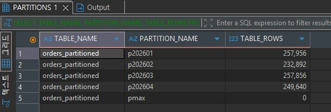
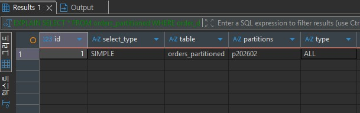

# MySQL 성능최적화 3 - 고급 실전편

> 대상 : MySQL 기본 인덱스, EXPLAIN 학습 완료자
> 목표 : 실제 서비스 수준의 튜닝 사례 학습

---

# 1. 함수 사용으로 인한 인덱스 무력화

## 주문 100만 건 생성

- orders 테이블에 100만 건 생성 후 테스트
```sql
DROP TABLE IF EXISTS orders;

CREATE TABLE orders (
    id INT AUTO_INCREMENT PRIMARY KEY,
    ordered_at DATETIME NOT NULL,
    user_id INT NOT NULL,
    amount INT NOT NULL
);

-- 재귀 깊이 증가
SET SESSION cte_max_recursion_depth = 1000000;

-- 100만 건 생성
INSERT INTO orders (ordered_at, user_id, amount)
WITH RECURSIVE cte(n) AS
(
    SELECT 1
    UNION ALL
    SELECT n + 1
      FROM cte
     WHERE n < 1000000
)
SELECT
    TIMESTAMP(
        DATE_SUB(NOW(), INTERVAL FLOOR(RAND() * 3650) DAY)
        + INTERVAL FLOOR(RAND() * 86400) SECOND
    ) AS ordered_at,

    FLOOR(1 + RAND() * 100000) AS user_id,

    FLOOR(1000 + RAND() * 99000) AS amount
FROM cte;
```

```sql
SELECT COUNT(*)
FROM orders;
```

### 나쁜 예

```sql
EXPLAIN
SELECT *
FROM orders
WHERE YEAR(ordered_at) = 2026;
```

결과

```text
type : ALL
key  : NULL
```

### 인덱스 생성

```sql
CREATE INDEX idx_orders_ordered_at
ON orders(ordered_at);
```

### 여전히 느림

```sql
EXPLAIN
SELECT *
FROM orders
WHERE YEAR(ordered_at) = 2026;
```

YEAR() 함수 때문에 인덱스 사용 불가

### 좋은 예

```sql
EXPLAIN
SELECT *
FROM orders
WHERE ordered_at >= '2026-01-01'
  AND ordered_at < '2027-01-01';
```

결과

```text
type : range
key  : idx_orders_ordered_at
```

---

# 2. HAVING 절 튜닝

### 테이블 생성

```sql
DROP TABLE IF EXISTS scores;
DROP TABLE IF EXISTS students;

CREATE TABLE students (
    student_id INT AUTO_INCREMENT PRIMARY KEY,
    name VARCHAR(100),
    age INT
);

CREATE TABLE scores (
    score_id BIGINT AUTO_INCREMENT PRIMARY KEY,
    student_id INT,
    year INT,
    semester INT,
    score INT,
    FOREIGN KEY(student_id)
        REFERENCES students(student_id)
);
```

### 100만건 학생/성적 데이터 생성

```sql
SET SESSION cte_max_recursion_depth = 1000000;

INSERT INTO students(name, age)
WITH RECURSIVE cte(n) AS
(
    SELECT 1
    UNION ALL
    SELECT n + 1
    FROM cte
    WHERE n < 1000000
)
SELECT
    CONCAT('Student', LPAD(n,7,'0')),
    FLOOR(18 + RAND() * 10)
FROM cte;

INSERT INTO scores
(
    student_id,
    year,
    semester,
    score
)
WITH RECURSIVE cte(n) AS
(
    SELECT 1
    UNION ALL
    SELECT n + 1
    FROM cte
    WHERE n < 1000000
)
SELECT
    FLOOR(1 + RAND() * 1000000),
    2024 + FLOOR(RAND() * 3),
    FLOOR(1 + RAND() * 2),
    FLOOR(1 + RAND() * 100)
FROM cte;
```

### 나쁜 예

```sql
SELECT st.student_id,
       AVG(sc.score)
FROM students st
JOIN scores sc
  ON st.student_id = sc.student_id
GROUP BY st.student_id, sc.year, sc.semester
HAVING AVG(sc.score)=100
   AND sc.year=2026
   AND sc.semester=1;
```

실행시간 : 약 40초 이상

### 개선

```sql
SELECT st.student_id,
       AVG(sc.score)
FROM students st
JOIN scores sc
  ON st.student_id = sc.student_id
WHERE sc.year=2026
  AND sc.semester=1
GROUP BY st.student_id, sc.year, sc.semester
HAVING AVG(sc.score)=100;
```

실행시간 : 약 1초대

---

# 3. Covering Index

테이블 접근 없이 인덱스만 읽기

```sql
CREATE INDEX idx_user_name_age
ON users(name, age);
```

### 실행

```sql
EXPLAIN
SELECT name, age
FROM users
WHERE name='홍길동';
```

결과

```text
Extra : Using index
```

---

# 4. Composite Index 순서

-- TODO

### 인덱스

```sql
CREATE INDEX idx_year_semester_student
ON scores(year, semester, student_id);
```

### 좋은 쿼리

```sql
SELECT *
FROM scores
WHERE year=2026
  AND semester=1;
```

### 나쁜 쿼리

```sql
SELECT *
FROM scores
WHERE semester=1;
```

복합인덱스의 좌측 컬럼 규칙 확인

---

# 5. Keyset Pagination

### OFFSET 방식

```sql
SELECT *
FROM posts
ORDER BY id DESC
LIMIT 20 OFFSET 900000;
```

### Keyset 방식

```sql
SELECT *
FROM posts
WHERE id < 100000
ORDER BY id DESC
LIMIT 20;
```

대용량 게시판 필수

---

# 6. Histogram 실습

데이터 분포

```text
서울 95%
부산 3%
대전 2%
```

### 생성

```sql
ANALYZE TABLE customers
UPDATE HISTOGRAM ON city;
```

### 확인

```sql
SELECT *
FROM information_schema.COLUMN_STATISTICS;
```

옵티마이저의 통계 정확도 향상

---

# 7. Invisible Index

### 인덱스 생성

```sql
CREATE INDEX idx_city
ON customers(city);
```

### 숨기기

```sql
ALTER TABLE customers
ALTER INDEX idx_city INVISIBLE;
```

### 복구

```sql
ALTER TABLE customers
ALTER INDEX idx_city VISIBLE;
```

운영 중 인덱스 제거 효과 테스트 가능

---

# 8. Clustered Index

```sql
CREATE TABLE members
(
    member_id INT PRIMARY KEY,
    name VARCHAR(100)
);
```

InnoDB는 PK 순서로 저장

PK 조회가 가장 빠름

---

# 9. JOIN 튜닝

### 나쁜 예

```sql
SELECT *
FROM orders o
JOIN users u
  ON o.user_id = u.id;
```

### 인덱스

```sql
CREATE INDEX idx_orders_userid
ON orders(user_id);
```

### 확인

```sql
EXPLAIN
SELECT *
FROM orders o
JOIN users u
  ON o.user_id = u.id;
```

```text
type : ref
```

---

# 10. 좋아요 TOP1000 게시글 조회

### 일반 방식

```sql
SELECT p.id,
       COUNT(l.id) AS like_count
FROM posts p
JOIN likes l
  ON p.id=l.post_id
GROUP BY p.id
ORDER BY like_count DESC
LIMIT 1000;
```

### 개선 방식

```sql
SELECT p.*, x.like_count
FROM posts p
JOIN (
    SELECT post_id,
           COUNT(*) AS like_count
    FROM likes
    GROUP BY post_id
    ORDER BY like_count DESC
    LIMIT 1000
) x
ON p.id=x.post_id;
```

대용량 집계 시 효과적

---

# 11. Deadlock 분석

```sql
SHOW ENGINE INNODB STATUS;
```

확인 항목

- Latest Detected Deadlock
- Waiting Transaction
- Locked Record

---

# 12. Performance Schema

가장 느린 SQL

```sql
SELECT *
FROM performance_schema.events_statements_summary_by_digest
ORDER BY AVG_TIMER_WAIT DESC
LIMIT 10;
```

가장 많이 실행된 SQL

```sql
SELECT *
FROM performance_schema.events_statements_summary_by_digest
ORDER BY COUNT_STAR DESC
LIMIT 10;
```

---

# 13. Partitioning

- 하나의 큰 테이블을 논리적으로 나누어 저장하는 기능
- 겉으로는 하나의 테이블처럼 보이지만 실제 여러개의 물리적 저장 단위로 나눠

## 사용이유

- 대용량 데이터 성능 개선
- 특정 조건 조회 속도 향상
- 데이터 관리(삭제/백업) 용이
- 오래된 데이터 빠른 정리 가능

예:

- 로그 테이블 (수천만 건 이상)
- IoT 센서 데이터
- 일별/월별 트랜잭션 데이터

## MySQL 파티셔닝 종류

### RANGE 파티션

값의 `범위 기준`으로 나눔.

```sql
CREATE TABLE orders (
    id INT,
    order_date DATE
)
PARTITION BY RANGE (YEAR(order_date)) (
    PARTITION p2023 VALUES LESS THAN (2024),
    PARTITION p2024 VALUES LESS THAN (2025),
    PARTITION pmax VALUES LESS THAN MAXVALUE
);
```

- 가장 많이 사용하는 방식으로
  - 2023 데이터는 p2023에 저장
  - 2024 데이터는 p2024에 저장

### List 파티션

`특정 값 목록 기준` 분할

```sql
PARTITION BY LIST (region_id) (
    PARTITION p_seoul VALUES IN (1),
    PARTITION p_busan VALUES IN (2),
    PARTITION p_etc VALUES IN (3,4,5)
);
```

- 특정 카테고리별 저장

### HASH 파티션

MySQL이 자동으로 해시값으로 분배

```sql
PARTITION BY HASH(id)
PARTITIONS 4;
```

- 균등분산의 목적
- 데이터 편중 방지

### KEY 파티션

HASH와 비슷하나 MySQL 내부 해시 함수 사용

```sql
PARTITION BY KEY(id)
PARTITIONS 4;
```

- 자동분산에 적합
- Primary Key 기반으로 자주 사용됨

## 파티셔닝의 핵심 개념

1. Partition Pruning

조건절에 맞는 파티션만 검색
-> 전체 테이블 스캔 방지
-> 성능 향상

```sql
-- 예 : 2024년 파티션만 조회
SELECT * FROM orders WHERE order_date = '2024-01-01';
```

2. 관리장점

```sql
ALTER TABLE orders DROP PARTITION p2023;
```

2023년 데이터 전체 삭제가 매우 빠름. DELETE 보다 훨씬 빠름

## 파티션 에제

### 파티션 테이블 생성

```sql
-- 1. 파티션 테이블 생성
DROP TABLE IF EXISTS orders_partitioned;

CREATE TABLE orders_partitioned (
    order_id BIGINT NOT NULL AUTO_INCREMENT,  -- 자동증가
    customer_id INT NOT NULL,                 -- 고객번호
    order_status VARCHAR(20) NOT NULL,        -- 주문상태, READY,DONE,CANCEL
    total_amount INT NOT NULL,                -- 주문 총금액
    order_date DATE NOT NULL,                 -- 주문일자
    created_at DATETIME NOT NULL DEFAULT CURRENT_TIMESTAMP,
    PRIMARY KEY (order_id, order_date)
)
PARTITION BY RANGE COLUMNS(order_date) (
    PARTITION p202601 VALUES LESS THAN ('2026-02-01'),
    PARTITION p202602 VALUES LESS THAN ('2026-03-01'),
    PARTITION p202603 VALUES LESS THAN ('2026-04-01'),
    PARTITION p202604 VALUES LESS THAN ('2026-05-01'),
    PARTITION pmax VALUES LESS THAN (MAXVALUE)
);
```

MySQL 파티션 테이블에서는
파티션 기준 컬럼이 Primary Key나 Unique Key에 포함되어야 함

여기서는 order_date로 파티션을 나누기 때문에
PK에도 order_date를 포함

### 데이터 삽입

```sql
SET SESSION cte_max_recursion_depth = 1000000;

INSERT INTO orders_partitioned
(customer_id, order_status, total_amount, order_date)
WITH RECURSIVE numbers AS (
    SELECT 1 AS n
    UNION ALL
    SELECT n + 1
    FROM numbers
    WHERE n < 1000000
)
SELECT
    (n % 100000) + 1 AS customer_id,
    CASE
        WHEN n % 10 = 0 THEN 'CANCEL'
        WHEN n % 3 = 0 THEN 'READY'
        ELSE 'DONE'
    END AS order_status,
    1000 + (n % 500000) AS total_amount,
    DATE_ADD('2026-01-01', INTERVAL (n % 120) DAY) AS order_date
FROM numbers;
```

### 파티션 확인

```sql
SELECT
    TABLE_NAME,
    PARTITION_NAME,
    TABLE_ROWS
FROM information_schema.PARTITIONS
WHERE TABLE_SCHEMA = DATABASE()
  AND TABLE_NAME = 'orders_partitioned';
```



### 조회 테스트

#### 월별 주문 조회

```sql
SELECT *
FROM orders_partitioned
WHERE order_date >= '2026-02-01'
  AND order_date < '2026-03-01';
```
이 쿼리는 전체 테이블을 뒤지는 것이 아니라
p202602 파티션만 조회할 수 있음

### 실행계획 확인

```sql
EXPLAIN
SELECT *
FROM orders_partitioned
WHERE order_date >= '2026-02-01'
  AND order_date < '2026-03-01';
```




### 나쁜 조회

```sql
SELECT *
FROM orders_partitioned
WHERE YEAR(order_date) = 2026;
```

이런 식으로 컬럼에 함수를 걸면
파티션 pruning이 제대로 안 될 수 있음

### 좋은 조회

```sql
SELECT *
FROM orders_partitioned
WHERE order_date >= '2026-01-01'
  AND order_date < '2027-01-01';
```

### 오래된 데이터 빠르게 삭제
- 일반삭제
```sql
DELETE FROM orders_partitioned
WHERE order_date >= '2026-01-01'
  AND order_date < '2026-02-01';
```

- 파티션 삭재

```sql
ALTER TABLE orders_partitioned DROP PARTITION p202601;
```

### 새 달 파티션 추가

현재 `pmax`가 있기 때문에 바로 추가하려면
`REORGANIZE PARTITION`을 사용

```sql
ALTER TABLE orders_partitioned
REORGANIZE PARTITION pmax INTO (
    PARTITION p202605 VALUES LESS THAN ('2026-06-01'),
    PARTITION pmax VALUES LESS THAN (MAXVALUE)
);
```

2026년 5월 데이터용 파티션이 추가

### 실무 운영방식

보통

```text
매월 1일
1. 다음 달 파티션 미리 생성
2. 보관 기간 지난 파티션 삭제
```

```sql
ALTER TABLE orders_partitioned DROP PARTITION p202601;

ALTER TABLE orders_partitioned
REORGANIZE PARTITION pmax INTO (
    PARTITION p202606 VALUES LESS THAN ('2026-07-01'),
    PARTITION pmax VALUES LESS THAN (MAXVALUE)
);
```

# 실무 체크리스트

- EXPLAIN 확인
- type = ALL 제거
- Covering Index 검토
- 복합인덱스 순서 확인
- 함수 사용 제거
- OFFSET 지양
- Slow Query Log 활성화
- Buffer Pool 점검
- Deadlock 모니터링


## 참조
- [x] 함수 사용으로 인한 인덱스 무력화 (현재 주문 예제)
- [x] HAVING → WHERE 튜닝 (현재 성적 예제)
- [x] Covering Index 실습
- [ ] Composite Index 컬럼 순서 실습
- [ ] Keyset Pagination 실습
- [ ] Histogram 실습
- [ ] Invisible Index 실습
- [ ] JOIN 튜닝 실습
- [ ] 좋아요 TOP1000 게시글 실습
- [ ] 파티셔닝(Partitioning) 실습
- [ ] Materialized Summary Table 실습
- [ ] Buffer Pool 성능 비교 실습
