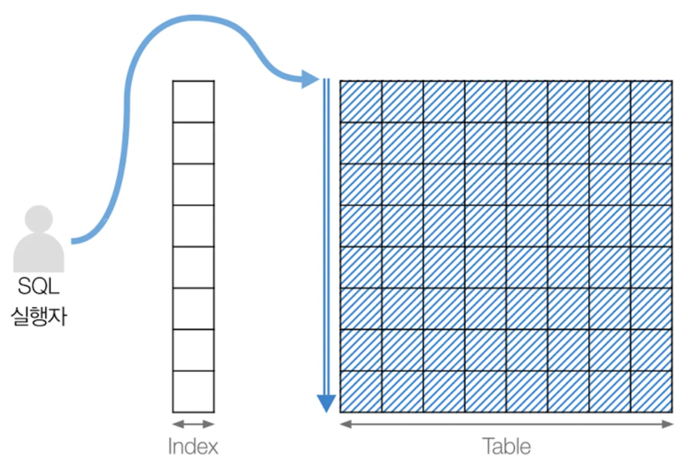
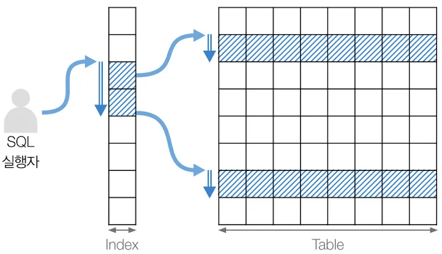

## MySQL 성능최적화 2

### 개요
- 데이터베이스 데이터를 사용하는데 처리시간을 줄이기위한 방안

#### SQL 튜닝
- 더미데이터 생성

```sql
-- 더미데이터 생성
drop table if exists users; # 기존 테이블 삭제

create table users (
   id INT auto_increment primary key,
   name VARCHAR(100),
   age INT
);

-- 높은 재귀(반복) 횟수를 허용하도록 설정
-- (아래에서 생성할 더미 데이터의 개수와 맞춰서 작성하면 된다.)
set
session cte_max_recursion_depth = 1000000;

-- 더미 데이터 삽입 쿼리
insert into users (name, age)
with recursive cte (n) as
(
	select 1
	 union all
 	select n + 1
	  from cte
	 where n < 1000000 -- 생성하고 싶은 더미 데이터의 개수
)
select CONCAT('User_', LPAD(n, 7, '0')),   -- 'User' 다음에 7자리 숫자로 구성된 이름 생성
       FLOOR(1 + RAND() * 1000) as age    -- 1부터 1000 사이의 난수로 나이 생성
  from cte;

-- 데이터 확인
select count(*) from users;

select * from users limit 100;
```

- 한꺼번에 100만개 데이터를 가져오지 말것
- 스크롤페이징(핀터레스트), 기본페이징(뽐뿌 게시판)
- MES, ERP 등 윈도우앱도 스크롤페이징 가장 많이 사용

#### WHERE절이 사용된 SQL튜닝

##### 최근 3일 이내에 가입한 유저 조회

```sql

DROP TABLE IF EXISTS users;

create table users (
  id INT auto_increment primary key,
  name VARCHAR(100),
  department VARCHAR(100),
  created_at TIMESTAMP default CURRENT_TIMESTAMP
);

set session cte_max_recursion_depth = 1000000;

-- 더미 데이터 삽입 쿼리
insert into users (name, department, created_at)
with recursive cte (n) as
(
select 1
union all
select n + 1 
from cte where n < 1000000 -- 생성하고 싶은 더미 데이터의 개수
)
SELECT
  CONCAT('User_', LPAD(n, 7, '0')) AS name,  -- 'User' 다음에 7자리 숫자로 구성된 이름 생성
  case
	when n % 10 = 1 then 'Engineering'
	when n % 10 = 2 then 'Marketing'
	when n % 10 = 3 then 'Sales'
	when n % 10 = 4 then 'Finance'
	when n % 10 = 5 then 'HR'
	when n % 10 = 6 then 'Operations'
	when n % 10 = 7 then 'IT'
	when n % 10 = 8 then 'Customer Service'
	when n % 10 = 9 then 'Research and Development'
	else 'Product Management'
  end AS department,  -- 의미 있는 단어 조합으로 부서 이름 생성
  TIMESTAMP(DATE_SUB(NOW(), INTERVAL FLOOR(RAND() * 3650) DAY) + INTERVAL FLOOR(RAND() * 86400) SECOND) AS created_at -- 최근 10년 내의 임의의 날짜와 시간 생성
FROM cte;
```



```sql
-- 최근 3일 이내 등록된 사람들 조회
-- explain analyze : 실행계획
 select * from users
  where created_at >= DATE_SUB(NOW(), interval 3 day);

/* Analyze는 맨아래에서부터 읽음
 * -> Filter: (users.created_at >= <cache>((now() - interval 3 day)))  (cost=34086 rows=332286) (actual time=0.134..289 rows=1113 loops=1)
    -> Table scan on users  (cost=34086 rows=996959) (actual time=0.0676..199 rows=1e+6 loops=1)
 */

-- 인덱스 생성
create index idx_users_created_at on users(created_at desc);

show index from users;

drop index idx_users_created_at on users;
/*
 * -> Index range scan on users using idx_users_created_at over ('2025-06-18 10:12:18' <= created_at), with index condition: (users.created_at >= <cache>((now() - interval 3 day)))  (cost=498 rows=1106) (actual time=0.63..4.77 rows=1106 loops=1)
 * */
```

- created_at에 인덱스가 안걸려있으면 full table scan 수행
- 인덱스 생성 후에는 range 타입으로 변경 수행



##### 최근3일이내이며 Sale부서인 유저 조회
- 이전 인덱스 삭제
```sql
-- 3일이내이면서 sale 부서 사용자 조회
-- explain analyze: 실행계획
select * from users
 where department = 'Sales'
   and created_at >= DATE_SUB(NOW(), interval 3 day);
```

- 인덱스 생성 방법 3가지
    1. created_at 컬럼에 인덱스 생성 : department는 따로 필터가 더 필요

        ```sql
        create index idx_users_created_at on users(created_at);

        -- 3일이내이면서 sale 부서 사용자 조회
        /*
        * -> Filter: ((users.department = 'Sales') and (users.created_at >= <cache>((now() - interval 3 day))))  (cost=93906 rows=33229) (actual time=1.66..254 rows=108 loops=1)
            -> Table scan on users  (cost=93906 rows=996959) (actual time=0.0605..196 rows=1e+6 loops=1)
        */
        ```
    
    2. department 컬럼에 인덱스 :

        ```sql
        create index idx_users_department on users(department);

        /*
        * -> Filter: (users.created_at >= <cache>((now() - interval 3 day)))  (cost=8948 rows=63765) (actual time=0.626..248 rows=108 loops=1)
            -> Index lookup on users using idx_users_department (department='Sales')  (cost=8948 rows=191314) (actual time=0.163..238 rows=100000 loops=1)
        */
        ```
    3. department와 created_at에 인덱스 생성

        ```sql
        create index idx_users_department on users(department);
        create index idx_users_created_at on users(created_at);
        show index from users;

        select department, count(*)
        from users
        group by department;

        /*
        * -> Filter: (users.department = 'Sales')  (cost=495 rows=211) (actual time=0.448..3.35 rows=107 loops=1)
            -> Index range scan on users using idx_users_created_at over ('2025-06-18 10:44:20' <= created_at), with index condition: (users.created_at >= <cache>((now() - interval 3 day)))  (cost=495 rows=1099) (actual time=0.442..3.29 rows=1099 loops=1)
        */
        ```
- 실행계획 상에서 possible key가 두 개. 두개다 인덱스를 사용할수 있다 판단. 옵티마이저가 department에 걸려있는 인덱스는 필요가 없다고 판단.
- 원래부터 분류가 되는 department등의 컬럼에는 인덱스가 효과가 별로 없음

#### 멀티인덱스
- 두 개이상의 컬럼에 인덱스를 거는 것

```sql
show index from users;
alter table users drop index idx_users_department;
drop index idx_users_depart_date on users;

create index idx_users_depart_date on users(created_at, department);
create index idx_users_depart_date on users(department, created_at);

-- 3일이내이면서 sale 부서 사용자 조회
-- explain analyze
select * from users
 where department = 'Sales'
   and created_at >= DATE_SUB(NOW(), interval 3 day);

-- 0.015초대 

/*
 * -> Index range scan on users using idx_users_depart_date over ('2025-06-18 11:11:06' <= created_at AND 'Sales' <= department), with index condition: ((users.department = 'Sales') and (users.created_at >= <cache>((now() - interval 3 day))))  (cost=493 rows=1094) (actual time=0.681..0.696 rows=107 loops=1)
 * */
```

- 두개의 컬럼에 인덱스를 걸어도 created_at에만 인덱스 생성시와 성능상에 차이가 별로 없음
- 멀리컬럼 인덱스이면서 select절에 인덱스의 컬럼만 사용 - 커버링 인덱스(성능에 가장 좋음)
- select 사용시 제발 * 는 쓰지말 것. count(*)은 예외

#### 인덱스가 제대로 동작하지 않는 경우

##### 첫번째 예시
```sql
drop table if exists users; # 기존 테이블 삭제

create table users (
   id INT auto_increment primary key,
   name VARCHAR(100),
   age INT
);

set session cte_max_recursion_depth = 2000000;

-- 더미 데이터 삽입 쿼리
insert into users (name, age)
with recursive cte (n) as
(
 select 1 
 union ALL
 SELECT n + 1 FROM cte WHERE n < 2000000 -- 생성하고 싶은 더미 데이터의 개수
)
SELECT 
   CONCAT('User_', LPAD(n, 7, '0')),   -- 'User' 다음에 7자리 숫자로 구성된 이름 생성
   FLOOR(1 + RAND() * 100) AS age    -- 1부터 100 사이의 난수로 나이 생성
FROM cte;


-- 데이터 확인
select count(*) from users;

-- 인덱스
create index idx_users_name on users(name);

-- 조회 쿼리
explain
select * from users
 order by name desc;
```

- name 컬럼에 인덱스를 걸어도 ALL(Full table scan)을 수행
- `옵티마이저`가 넓은 범위의 데이터를 조회할 때는 인덱스 활용이 비효율적이라고 판단

```sql
-- 인덱스를 사용해서 더 늦어졌음
select * from users force index (idx_users_name)
 order by name desc;
```

##### 두번째 예시
- 테이블 및 더미데이터 생성
```sql
drop table if exists users;

create table users (
   id INT auto_increment primary key,
   name VARCHAR(100),
   salary INT,
   created_at TIMESTAMP default CURRENT_TIMESTAMP
);

set session cte_max_recursion_depth = 2000000;

-- users 테이블에 더미 데이터 삽입
INSERT INTO users (name, salary, created_at)
WITH RECURSIVE cte (n) AS
(
 SELECT 1
 UNION ALL
 SELECT n + 1 FROM cte WHERE n < 2000000 -- 생성하고 싶은 더미 데이터의 개수
)
SELECT 
   CONCAT('User_', LPAD(n, 7, '0')) AS name,  -- 'User' 다음에 7자리 숫자로 구성된 이름 생성
   FLOOR(1 + RAND() * 1000000) AS salary,    -- 1부터 1000000 사이의 난수로 급여 생성
   TIMESTAMP(DATE_SUB(NOW(), INTERVAL FLOOR(RAND() * 3650) DAY) + INTERVAL FLOOR(RAND() * 86400) SECOND) AS created_at -- 최근 10년 내의 임의의 날짜와 시간 생성
FROM cte;

select count(*) from users;

-- 인덱스 생성
create index idx_users_name on users(name);
create index idx_users_salary on users(salary);
```

- 함수사용 : where 절 왼쪽열에 함수를 사용하면 ALL타입. 속도가 느림
```sql
-- 함수를 왼쪽에 사용하면 속도가 더 느림
explain
select * from users
 where substring(name, 1, 10) = 'User_00000';

explain
select * from users
 where name like 'User_00000__';

select * from users force index(idx_users_name)
 where name like 'User_00000%';
```

- 산술연산 : 왼쪽에 계산을 하면 ALL타입
```sql
explain analyze
select * from users
 where salary * 2 < 1000 
 order by salary;
/*
 * -> Sort: users.salary  (cost=200953 rows=1.99e+6) (actual time=590..590 rows=938 loops=1)
    -> Filter: ((users.salary * 2) < 1000)  (cost=200953 rows=1.99e+6) (actual time=0.122..589 rows=938 loops=1)
        -> Table scan on users  (cost=200953 rows=1.99e+6) (actual time=0.0868..506 rows=2e+6 loops=1)
 */

explain analyze
select * from users
 where salary < (1000 / 2)
 order by salary;
/*
 * -> Index range scan on users using idx_users_salary over (NULL < salary < 500), with index condition: (users.salary < <cache>((1000 / 2)))  (cost=428 rows=938) (actual time=0.358..2.8 rows=938 loops=1)
 */
```

- 조건절에서 인덱스컬럼은 가공을 하지 말것(함수사용, 산술연산, 문자열 조작...)

#### ORDER BY 튜닝

```sql
explain 
select * from users
 order by salary
 limit 100;

/* 인덱스 생성 이전
 * -> Limit: 100 row(s)  (cost=201024 rows=100) (actual time=582..582 rows=100 loops=1)
    -> Sort: users.salary, limit input to 100 row(s) per chunk  (cost=201024 rows=1.99e+6) (actual time=582..582 rows=100 loops=1)
        -> Table scan on users  (cost=201024 rows=1.99e+6) (actual time=0.0643..429 rows=2e+6 loops=1)
 */

/* 인덱스 생성 후
 * -> Limit: 100 row(s)  (cost=0.132 rows=100) (actual time=0.0927..0.464 rows=100 loops=1)
    -> Index scan on users using idx_users_salary  (cost=0.132 rows=100) (actual time=0.0915..0.458 rows=100 loops=1)
 */

-- 인덱스 생성
create index idx_users_salary on users(salary); 
```

- 인덱스 생성 이전 : ALL(Full table scan)을 수행
    - 200만건을 전부 조회 후
    - salary기준으로 정렬
    - limit로 100건만 조회

- 인덱스 생성 : index(Index table scan)을 수행
    - 인덱스 스캔하면서 100건만 조회(인덱스 자체가 정렬완료)

- 단, limit가 없으면 인덱스가 있어도 Full table scan 수행

#### WHERE절 인덱스, ORDER BY 인덱스
- 어떤 방법이 적절한 성능을 발휘하는지 실행계획, SQL 실행시간으로 찾아야 함

##### 데이터 조회 성능 측정
- 최근 3일 이내에 Sale부서 사용자 데이터를 salary 정렬한 뒤 100건만 조회
```sql
-- 인덱스 생성
create index idx_users_salary on users(salary);

-- 최근 3일 이내에 Sale부서 사용자 데이터를 salary 정렬한 뒤 100건만
explain
select * from users
 where created_at >= date_sub(now(), interval 3 day)
   and department = 'sales'
 order by salary
 limit 100;

drop index idx_users_salary on users;
create index idx_users_created_at on users(created_at);
```

- salary에 인덱스를 걸면 Index full scan(Index)수행. 원본테이블을 다 읽음
```sql
/* 인덱스 없을때
 * -> Limit: 100 row(s)  (cost=189573 rows=100) (actual time=767..767 rows=100 loops=1)
    -> Sort: users.salary, limit input to 100 row(s) per chunk  (cost=189573 rows=1.99e+6) (actual time=767..767 rows=100 loops=1)
        -> Filter: ((users.department = 'sales') and (users.created_at >= <cache>((now() - interval 3 day))))  (cost=189573 rows=1.99e+6) (actual time=3.55..766 rows=220 loops=1)
            -> Table scan on users  (cost=189573 rows=1.99e+6) (actual time=1.55..642 rows=2e+6 loops=1)
 */

/* salary 컬럼 인덱스 
 * -> Limit: 100 row(s)  (cost=9.09 rows=3.33) (actual time=60.9..14832 rows=100 loops=1)
    -> Filter: ((users.department = 'sales') and (users.created_at >= <cache>((now() - interval 3 day))))  (cost=9.09 rows=3.33) (actual time=60.9..14832 rows=100 loops=1)
        -> Index scan on users using idx_users_salary  (cost=9.09 rows=100) (actual time=1.88..14689 rows=780101 loops=1)
 * */

/* created_at 컬럼 인덱스
 * -> Limit: 100 row(s)  (cost=1397 rows=100) (actual time=7.53..7.53 rows=100 loops=1)
    -> Sort: users.salary, limit input to 100 row(s) per chunk  (cost=1397 rows=2089) (actual time=7.53..7.53 rows=100 loops=1)
        -> Filter: (users.department = 'sales')  (cost=1397 rows=2089) (actual time=0.752..7.45 rows=220 loops=1)
            -> Index range scan on users using idx_users_created_at over ('2025-06-18 14:14:37' <= created_at), with index condition: (users.created_at >= <cache>((now() - interval 3 day)))  (cost=1397 rows=2089) (actual time=0.742..7.34 rows=2089 loops=1)
 * */
```

- 인덱스가 없을때나, limit가 없으면 Full Table scan 발생
- `인덱스` 
    - Salary : 금액에 대해서 정렬. 날짜를 다시 조회할 때 원본테이블에 분포된 여러위치의 데이터 추가적인 조회필요. Full table scan보다 속도가 더 느릴 수 있음
    - created_at : 날짜별로 정렬. 원본테이블에서 Salary위치를 찾는 것이 위의 경우보다 효율적
- ORDER BY 컬럼보다 `WHERE절 컬럼`에 인덱스가 성능향상에 도움이 됨. 항상 일치하지는 않음

#### HAVING절 튜닝
- 테이블 생성 및 더미데이터
```sql
DROP TABLE IF EXISTS users;

CREATE TABLE users (
   id INT AUTO_INCREMENT PRIMARY KEY,
   name VARCHAR(100),
   age INT,
   department VARCHAR(100),
   salary INT,
   created_at TIMESTAMP DEFAULT CURRENT_TIMESTAMP
);

SET SESSION cte_max_recursion_depth = 2000000;

-- 더미 데이터 삽입 쿼리
INSERT INTO users (name, age, department, salary, created_at)
WITH RECURSIVE cte (n) AS
(
 SELECT 1
 UNION ALL
 SELECT n + 1 FROM cte WHERE n < 2000000 -- 생성하고 싶은 더미 데이터의 개수
)
SELECT 
   CONCAT('User', LPAD(n, 7, '0')) AS name,  -- 'User' 다음에 7자리 숫자로 구성된 이름 생성
   FLOOR(1 + RAND() * 100) AS age, -- 1부터 100 사이의 난수로 생성
   CASE 
       WHEN n % 10 = 1 THEN 'Engineering'
       WHEN n % 10 = 2 THEN 'Marketing'
       WHEN n % 10 = 3 THEN 'Sales'
       WHEN n % 10 = 4 THEN 'Finance'
       WHEN n % 10 = 5 THEN 'HR'
       WHEN n % 10 = 6 THEN 'Operations'
       WHEN n % 10 = 7 THEN 'IT'
       WHEN n % 10 = 8 THEN 'Customer Service'
       WHEN n % 10 = 9 THEN 'Research and Development'
       ELSE 'Product Management'
   END AS department,  -- 의미 있는 단어 조합으로 부서 이름 생성
   FLOOR(1 + RAND() * 1000000) AS salary,    -- 1부터 1000000 사이의 난수로 생성
   TIMESTAMP(DATE_SUB(NOW(), INTERVAL FLOOR(RAND() * 3650) DAY) + INTERVAL FLOOR(RAND() * 86400) SECOND) AS created_at -- 최근 10년 내의 임의의 날짜와 시간 생성
FROM cte;


select count(*) from users;
```

##### 기본 실행쿼리
```sql
-- explain analyze
select age, MAX(salary) from users
 group by age
having age >= 20 and age < 30;
/*
 * -> Filter: ((users.age >= 20) and (users.age < 30))  (actual time=844..844 rows=10 loops=1)
    -> Table scan on <temporary>  (actual time=844..844 rows=100 loops=1)
        -> Aggregate using temporary table  (actual time=844..844 rows=100 loops=1)
            -> Table scan on users  (cost=201571 rows=1.99e+6) (actual time=0.0999..533 rows=2e+6 loops=1)
 */
```
- 전체 200만건 조회 후 통계테이블 생성, 통계테이블 스캔 후 필터링

##### 잘못된 인덱스 생성
```sql
create index idx_users_age on users(age);

-- explain analyze
select age, MAX(salary) from users
 group by age
having age >= 20 and age < 30;
/*
 * -> Filter: ((users.age >= 20) and (users.age < 30))  (cost=401637 rows=90) (actual time=5826..27141 rows=10 loops=1)
    -> Group aggregate: max(users.salary)  (cost=401637 rows=90) (actual time=212..27141 rows=100 loops=1)
        -> Index scan on users using idx_users_age  (cost=202384 rows=1.99e+6) (actual time=5.9..27029 rows=2e+6 loops=1)
 */
```

- age인덱스 테이블과 salary 집계와는 관계없음. 추가적인 테이블 스캔 + 집계 발생
- 나이로는 정렬되어 있지만 salary로 정렬이 안되어 있음

##### 멀티인덱스 생성
```sql
-- 멀티인덱스 사용
drop index idx_users_age on users;
drop index idx_users_age_salary on users;
create index idx_users_age_salary on users(age, salary DESC);

-- explain analyze
select age, MAX(salary) from users
 group by age
having age >= 20 and age < 30;
/*
 * -> Filter: ((users.age >= 20) and (users.age < 30))  (cost=130 rows=96) (actual time=0.13..0.441 rows=10 loops=1)
    -> Covering index skip scan for grouping on users using idx_users_age_salary  (cost=130 rows=96) (actual time=0.0427..0.429 rows=100 loops=1)
 */
```

- age 오름차순, salary 내림차순으로 미리 정렬되어 있음
- 조회하고자 하는 방식대로 인덱스 생성되어 있음

##### HAVING -> WHERE절로 변경
```sql
-- HAVING 대신 WHERE절 사용 : AGGREGATE(집계)함수의 수치를 필터링시 사용
-- explain analyze
select age, MAX(salary) from users
 where age >= 20 and age < 30
 group by age;
/*
 * -> Filter: ((users.age >= 20) and (users.age < 30))  (cost=28.4 rows=21) (actual time=0.0241..0.052 rows=10 loops=1)
    -> Covering index skip scan for grouping on users using idx_users_age_salary over (20 <= age < 30)  (cost=28.4 rows=21) (actual time=0.0213..0.0483 rows=10 loops=1)
 */
```

- having은 집계함수 수치를 필터링. where절에 사용불가
- 나이를 비교하는 구문은 having에 쓰는 것 자체가 비효율적


#### SQL 튜닝 정리

##### 좌변연산을 하지말 것
- 인덱스가 걸려있는 컬럼값을 함수나, 연산 등을 하지 말아라
- YEAR, MONTH() 함수를 쓴다고 엄청나게 느려지진 않음(SQL엔진 최적화 때문)

##### OR대신에 UNION을 사용하라
- OR연산은 테이블 스캔시 모든 조건을 확인해야 함
- UNION은 각각의 쿼리가 조건을 필터링한 뒤 합치는 작업만 수행
- MySQL 엔진 버전업되면서 많이 상쇄되었음. 많은 효과는 없음

##### 필요한 row만 선택하라
- 처음부터 작은 row를 선별해서 처리하는 것이 가장 효과적

##### 서브쿼리보다는 JOIN을 사용하라
- 서브쿼리는 Full table scan을 수행
- JOIN은 인덱스가 걸려있는 테이블을 합치는 작업
- 같은 기능 쿼리라면 SubQuery를 JOIN으로 변경할 것

##### 서브쿼리를 사용, 필요한 데이터만 추출
- 불필요한 컬럼은 제거하고 필요한 컬럼만으로 임시테이블을 생성
- 시스템 자원을 효율적으로 활용

##### 집계, 분석함수로 데이터 줄이기
- ROW_NUMBER()로 랭킹을 사용, 필요 데이터만 limit등으로 추출 후 처리

##### 문자열 비교시 % 
- 와일드카드로 LIKE 사용시 '%0900%'는 최악
- '%0900' 식의 조회는 모덴 가능한 문자열 조합을 다 검색
- '0900%' 와일드카드로 끝나는 비교는 빠르게 데이터를 조회

##### 계산값은 미리 저장할 것
- 통계, 취합 후 리포트 데이터들은 임시 통계테이블에 보관
- 업무시간 이후 새벽등에 배치를 통해서 통계테이블을 생성


#### 튜닝 연습

##### 사용자 이름으로 특정 기간에 작성된 글 검색
```sql
DROP TABLE IF EXISTS posts;
DROP TABLE IF EXISTS users;

CREATE TABLE users (
   id INT AUTO_INCREMENT PRIMARY KEY,
   name VARCHAR(50) NOT NULL,
   created_at TIMESTAMP DEFAULT CURRENT_TIMESTAMP
);

CREATE TABLE posts (
   id INT AUTO_INCREMENT PRIMARY KEY,
   title VARCHAR(255) NOT NULL,
   created_at TIMESTAMP DEFAULT CURRENT_TIMESTAMP,
   user_id INT,
   FOREIGN KEY (user_id) REFERENCES users(id)
);
```

- 예전에는 FK에 인덱스가 걸리지 않았음.
- MySQL 8.x 에서는 FK에 인덱스가 생성됨

```sql
-- 더미데이터
set session cte_max_recursion_depth = 1000000;

-- users 테이블에 더미 데이터 삽입
insert into users (name, created_at)
with recursive cte (n) as
(
 select 1
 union all
 select n + 1 FROM cte WHERE n < 1000000 -- 생성하고 싶은 더미 데이터의 개수
)
select 
   CONCAT('User', LPAD(n, 7, '0')) AS name,  -- 'User' 다음에 7자리 숫자로 구성된 이름 생성
   TIMESTAMP(DATE_SUB(NOW(), INTERVAL FLOOR(RAND() * 3650) DAY) + INTERVAL FLOOR(RAND() * 86400) SECOND) AS created_at -- 최근 10년 내의 임의의 날짜와 시간 생성
from cte;

-- posts 테이블에 더미 데이터 삽입
insert into posts (title, created_at, user_id)
with recursive cte (n) as
(
 SELECT 1
 UNION ALL
 SELECT n + 1 FROM cte WHERE n < 1000000 -- 생성하고 싶은 더미 데이터의 개수
)
SELECT 
   CONCAT('Post', LPAD(n, 7, '0')) AS name,  -- 'User' 다음에 7자리 숫자로 구성된 이름 생성
   TIMESTAMP(DATE_SUB(NOW(), INTERVAL FLOOR(RAND() * 3650) DAY) + INTERVAL FLOOR(RAND() * 86400) SECOND) AS created_at, -- 최근 10년 내의 임의의 날짜와 시간 생성
   FLOOR(1 + RAND() * 50000) AS user_id -- 1부터 50000 사이의 난수로 급여 생성
FROM cte;


select count(*) from users;
select count(*) from posts;
```

- 성능개선을 위해 인덱스 생성
```sql
-- 최초 SQL 조회
explain
select p.id, p.title, p.created_at
  from posts p
  join users u on u.id = p.user_id
 where u.name like 'User000004%'
   and p.created_at between '2024-01-01' and '2024-12-31';

-- 인덱스 추가
create index idx_users_name on users(name);
create index idx_posts_created_at on posts(created_at);

explain
select p.id, p.title, p.created_at
  from posts p
  join users u on u.id = p.user_id
 where u.name like 'User000004%'
   and p.created_at between '2024-01-01' and '2024-12-31';
```

##### 2024년 주문데이터 조회 쿼리
- 더미데이터 생성
```sql
DROP TABLE IF EXISTS users;
DROP TABLE IF EXISTS orders;

CREATE TABLE users (
   id INT AUTO_INCREMENT PRIMARY KEY,
   name VARCHAR(100),
   created_at TIMESTAMP DEFAULT CURRENT_TIMESTAMP
);

CREATE TABLE orders (
   id INT AUTO_INCREMENT PRIMARY KEY,
   ordered_at TIMESTAMP DEFAULT CURRENT_TIMESTAMP,
   user_id INT,
   FOREIGN KEY (user_id) REFERENCES users(id)
);

-- 더미데이터 생성
SET SESSION cte_max_recursion_depth = 1000000;

-- users 테이블에 더미 데이터 삽입
INSERT INTO users (name, created_at)
WITH RECURSIVE cte (n) AS
(
 SELECT 1
 UNION ALL
 SELECT n + 1 FROM cte WHERE n < 1000000 -- 생성하고 싶은 더미 데이터의 개수
)
SELECT 
   CONCAT('User', LPAD(n, 7, '0')) AS name,  -- 'User' 다음에 7자리 숫자로 구성된 이름 생성
   TIMESTAMP(DATE_SUB(NOW(), INTERVAL FLOOR(RAND() * 3650) DAY) + INTERVAL FLOOR(RAND() * 86400) SECOND) AS created_at -- 최근 10년 내의 임의의 날짜와 시간 생성
FROM cte;

-- orders 테이블에 더미 데이터 삽입
INSERT INTO orders (ordered_at, user_id)
WITH RECURSIVE cte (n) AS
(
 SELECT 1
 UNION ALL
 SELECT n + 1 FROM cte WHERE n < 1000000 -- 생성하고 싶은 더미 데이터의 개수
)
SELECT 
   TIMESTAMP(DATE_SUB(NOW(), INTERVAL FLOOR(RAND() * 3650) DAY) + INTERVAL FLOOR(RAND() * 86400) SECOND) AS ordered_at, -- 최근 10년 내의 임의의 날짜와 시간 생성
   FLOOR(1 + RAND() * 1000000) AS user_id    -- 1부터 1000000 사이의 난수로 급여 생성
FROM cte;

select count(*) from users;
select count(*) from orders;
```

- 기본쿼리
```sql
-- 기본 쿼리
explain
select *
  from orders
 where YEAR(ordered_at) = 2024
 order by ordered_at
 limit 10000;   -- 0.3s, all type

-- 인덱스 생성
create index idx_orders_ordered_at on orders(ordered_at);

-- 재조회
-- explain
select *
  from orders
 where YEAR(ordered_at) = 2024
 order by ordered_at
 limit 10000;   -- 0.3s, all type
```
- 인덱스를 만든다고 도움이 되지 않음. 

- 쿼리 수정
```sql
-- 쿼리 수정
-- explain
select *
  from orders
 where ordered_at >= '2024-01-01 00:00:00'
   and ordered_at < '2025-01-01 00:00:00'
  limit 10000;   -- 0.1s, range type
 
-- 동일쿼리
select *
  from orders
 where ordered_at between '2024-01-01 00:00:00' 
  and '2024-12-31 23:59:59'
 limit 10000;   -- 0.1s, range type
```
- 실행계획 타입이 ALL -> range 변경. 실행시간 성능 개선


##### 24년 1학기 평균 성적이 100점 학생 조회
- 더미데이터 
```sql
DROP TABLE IF EXISTS scores;
DROP TABLE IF EXISTS subjects;
DROP TABLE IF EXISTS students;

CREATE TABLE students (
   student_id INT AUTO_INCREMENT PRIMARY KEY,
   name VARCHAR(100),
   age INT
);

CREATE TABLE subjects (
   subject_id INT AUTO_INCREMENT PRIMARY KEY,
   name VARCHAR(100)
);

CREATE TABLE scores (
   score_id INT AUTO_INCREMENT PRIMARY KEY,
   student_id INT,
   subject_id INT,
   year INT,
   semester INT,
   score INT,
   FOREIGN KEY (student_id) REFERENCES students(student_id),
   FOREIGN KEY (subject_id) REFERENCES subjects(subject_id)
);

-- 더미데이터
SET SESSION cte_max_recursion_depth = 1000000;

-- students 테이블에 더미 데이터 삽입
INSERT INTO students (name, age)
WITH RECURSIVE cte (n) AS
(
 SELECT 1
 UNION ALL
 SELECT n + 1 FROM cte WHERE n < 1000000 -- 생성하고 싶은 더미 데이터의 개수
)
SELECT 
   CONCAT('Student', LPAD(n, 7, '0')) AS name,  -- 'User' 다음에 7자리 숫자로 구성된 이름 생성
   FLOOR(1 + RAND() * 100) AS age -- 1부터 100 사이의 랜덤한 점수 생성
FROM cte;

-- subjects 테이블에 과목 데이터 삽입
INSERT INTO subjects (name)
VALUES
   ('Mathematics'),
   ('English'),
   ('History'),
   ('Biology'),
   ('Chemistry'),
   ('Physics'),
   ('Computer Science'),
   ('Art'),
   ('Music'),
   ('Physical Education'),
   ('Geography'),
   ('Economics'),
   ('Psychology'),
   ('Philosophy'),
   ('Languages'),
   ('Engineering');

-- scores 테이블에 더미 데이터 삽입
INSERT INTO scores (student_id, subject_id, year, semester, score)
WITH RECURSIVE cte (n) AS
(
 SELECT 1
 UNION ALL
 SELECT n + 1 FROM cte WHERE n < 1000000 -- 생성하고 싶은 더미 데이터의 개수
)
SELECT 
   FLOOR(1 + RAND() * 1000000) AS student_id,  -- 1부터 1000000 사이의 난수로 학생 ID 생성
   FLOOR(1 + RAND() * 16) AS subject_id,             -- 1부터 16 사이의 난수로 과목 ID 생성
   YEAR(NOW()) - FLOOR(RAND() * 5) AS year,   -- 최근 5년 내의 임의의 연도 생성
   FLOOR(1 + RAND() * 2) AS semester,                -- 1 또는 2 중에서 랜덤하게 학기 생성
   FLOOR(1 + RAND() * 100) AS score -- 1부터 100 사이의 랜덤한 점수 생성
FROM cte;


select count(*) from students;
select count(*) from subjects;
select count(*) from scores;
```

- 기본쿼리 : 대략 47초 소요
```sql
select st.student_id, st.name, avg(sc.score) as average_score
  from students st
  join scores sc 
    on st.student_id = sc.student_id
 group by st.student_id, st.name, sc.year, sc.semester
having avg(sc.score) = 100
   and sc.year = 2024
   and sc.semester = 1;   -- 47s
```

- 개선쿼리 : having절에서 where절로 이전. 대략 1.3초 소요
```sql
-- 개선 쿼리
select st.student_id, st.name, avg(sc.score) as average_score
  from students st
  join scores sc 
    on st.student_id = sc.student_id
 where sc.year = 2024
   and sc.semester = 1
 group by st.student_id, st.name, sc.year, sc.semester
having avg(sc.score) = 100;  -- 1.381s
```

- 인덱스 생성 : 속도 저하발생. 3초 대 소요
```sql
-- 인덱스 생성
create index idx_scores_year_semester on scores(year, semester);

select st.student_id, st.name, avg(sc.score) as average_score
  from students st
  join scores sc 
    on st.student_id = sc.student_id
 where sc.year = 2024
   and sc.semester = 1
 group by st.student_id, st.name, sc.year, sc.semester
having avg(sc.score) = 100;  -- 3.375s

drop index idx_scores_year_semester on scores;
```

##### 좋아요 내림차순으로 게시글 조회 
- 더미데이터
```sql
DROP TABLE IF EXISTS likes;
DROP TABLE IF EXISTS orders;
DROP TABLE IF EXISTS users;
DROP TABLE IF EXISTS posts;


CREATE TABLE posts (
   id INT AUTO_INCREMENT PRIMARY KEY,
   title VARCHAR(255) NOT NULL,
   created_at TIMESTAMP DEFAULT CURRENT_TIMESTAMP
);

CREATE TABLE users (
   id INT AUTO_INCREMENT PRIMARY KEY,
   name VARCHAR(50) NOT NULL,
   created_at TIMESTAMP DEFAULT CURRENT_TIMESTAMP
);

CREATE TABLE likes (
   id INT AUTO_INCREMENT PRIMARY KEY,
   post_id INT,
   user_id INT,
   created_at TIMESTAMP DEFAULT CURRENT_TIMESTAMP,
   FOREIGN KEY (post_id) REFERENCES posts(id),
   FOREIGN KEY (user_id) REFERENCES users(id)
);

SET SESSION cte_max_recursion_depth = 1000000;

-- posts 테이블에 더미 데이터 삽입
INSERT INTO posts (title, created_at)
WITH RECURSIVE cte (n) AS
(
 SELECT 1
 UNION ALL
 SELECT n + 1 FROM cte WHERE n < 1000000 -- 생성하고 싶은 더미 데이터의 개수
)
SELECT 
   CONCAT('Post', LPAD(n, 7, '0')) AS name,  -- 'User' 다음에 7자리 숫자로 구성된 이름 생성
   TIMESTAMP(DATE_SUB(NOW(), INTERVAL FLOOR(RAND() * 3650) DAY) + INTERVAL FLOOR(RAND() * 86400) SECOND) AS created_at -- 최근 10년 내의 임의의 날짜와 시간 생성
FROM cte;

-- users 테이블에 더미 데이터 삽입
INSERT INTO users (name, created_at)
WITH RECURSIVE cte (n) AS
(
 SELECT 1
 UNION ALL
 SELECT n + 1 FROM cte WHERE n < 1000000 -- 생성하고 싶은 더미 데이터의 개수
)
SELECT 
   CONCAT('User', LPAD(n, 7, '0')) AS name,  -- 'User' 다음에 7자리 숫자로 구성된 이름 생성
   TIMESTAMP(DATE_SUB(NOW(), INTERVAL FLOOR(RAND() * 3650) DAY) + INTERVAL FLOOR(RAND() * 86400) SECOND) AS created_at -- 최근 10년 내의 임의의 날짜와 시간 생성
FROM cte;

-- likes 테이블에 더미 데이터 삽입
INSERT INTO likes (post_id, user_id, created_at)
WITH RECURSIVE cte (n) AS
(
 SELECT 1
 UNION ALL
 SELECT n + 1 FROM cte WHERE n < 1000000 -- 생성하고 싶은 더미 데이터의 개수
)
SELECT 
   FLOOR(1 + RAND() * 1000000) AS post_id,    -- 1부터 1000000 사이의 난수로 급여 생성
   FLOOR(1 + RAND() * 1000000) AS user_id,    -- 1부터 1000000 사이의 난수로 급여 생성
   TIMESTAMP(DATE_SUB(NOW(), INTERVAL FLOOR(RAND() * 3650) DAY) + INTERVAL FLOOR(RAND() * 86400) SECOND) AS created_at -- 최근 10년 내의 임의의 날짜와 시간 생성
FROM cte;
```

```sql
-- 테스트 쿼리
SELECT
   p.id,
   p.title,
   p.created_at,
   COUNT(l.id) AS like_count
FROM
   posts p
INNER JOIN
   likes l ON p.id = l.post_id
GROUP BY
   p.id, p.title, p.created_at
ORDER BY
   like_count DESC
LIMIT 1000;

-- 성능개선 쿼리
SELECT p.*, l.like_count
FROM posts p
INNER JOIN
        (SELECT post_id, count(post_id) AS like_count FROM likes l
        GROUP BY l.post_id
        ORDER BY like_count DESC
        LIMIT 1000) l
ON p.id = l.post_id;
```